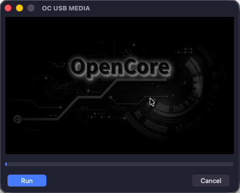
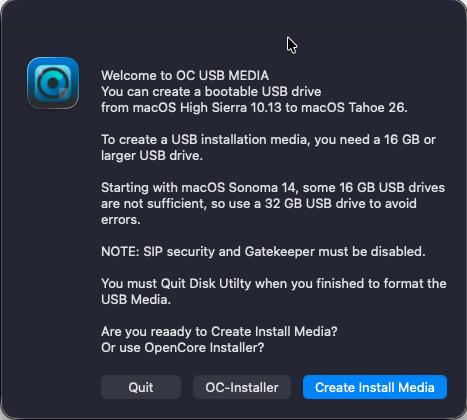

[](https://github.com/chris1111/OC-USB-MEDIA/blob/main/LICENSE) [](https://github.com/chris1111/OC-USB-MEDIA/actions/workflows/Build.yml) 

# OC USB MEDIA


### It is an Objective-C project utility for creating a macOS installation USB drive. 
  You can create a bootable USB drive
  from macOS High Sierra 10.13 to macOS Tahoe 26.
  You also have the option to install OpenCore after the post-installation process.

### Download the Release ➥ [OC USB MEDIA](https://github.com/chris1111/OC-USB-MEDIA/releases/tag/ocusbmedia-latest)
-------------------------------------------

- [x] `Clone and build OC USB MEDIA:` You need Xcode
```bash
git clone https://github.com/chris1111/OC-USB-MEDIA.git && cd $HOME/OC-USB-MEDIA && make
```
-------------------------------------------



